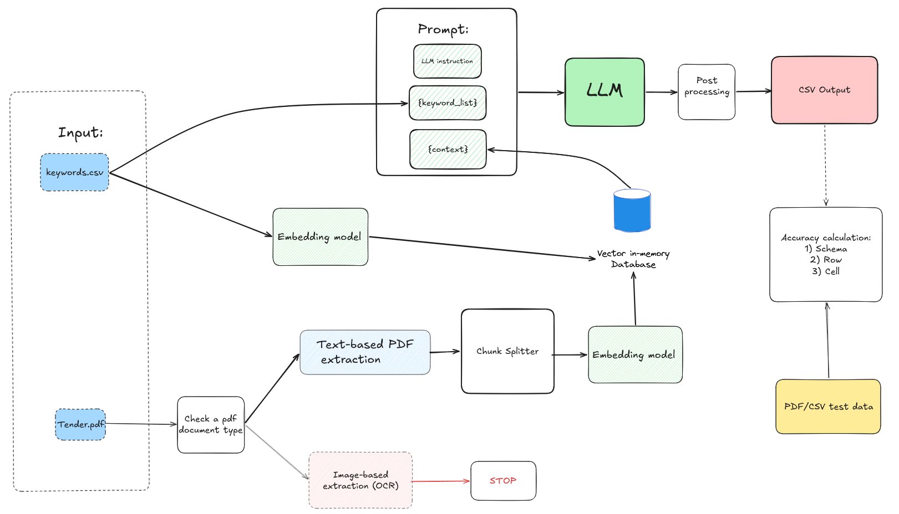
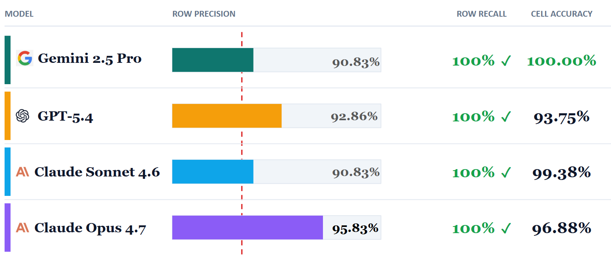

# ProEngineers: Tender PDF-to-CSV Extractor

> RAG system that automatically identifies and extracts facade & masonry positions from Swiss construction tender PDFs into structured CSV output.

**Client:** [ProEngineers](https://www.pro-eng.ch/) and Partners - digital tools for the Swiss construction industry  
**Team:** Vasili Areshka, Hanna Sliashynskaya  
**Status:** Deployed in production on ProEngineers' infrastructure

> **Note:** Source code is confidential under NDA.

---

## Problem

Construction companies receive dozens of tender documents daily. Each tender is long, highly technical, and inconsistently formatted — yet only a small fraction of positions (facade, masonry) is relevant to any given contractor. Manual review is slow and error-prone.

ProEngineers needed a tool that could:
- Automatically parse tender PDFs at scale
- Identify only the facade and masonry-related line items
- Output a clean, structured CSV ready for further processing

---

## Solution — RAG Pipeline

We combined **semantic document retrieval** with a **large language model** to solve the extraction problem end-to-end.

The pipeline:
1. Detects whether the input PDF is text-based or image-based (OCR path)
2. Splits the text into overlapping chunks and embeds them
3. Uses a keyword list to query the vector store for relevant chunks
4. Passes retrieved context + keywords into an LLM prompt
5. Post-processes the LLM response into validated CSV rows

---

## System Architecture

**Pipeline components:**

| Component | Role |
|---|---|
| `keywords.csv` | Domain keyword list for facade & masonry products |
| PDF type check | Routes text-based PDFs to extraction; halts on image-only PDFs |
| Text-based PDF extraction | Extracts raw text from parseable PDFs |
| Chunk Splitter | Splits extracted text into overlapping segments |
| Embedding model | Encodes chunks and keyword queries into vector space |
| Vector in-memory DB | Stores chunk embeddings; retrieves top-k relevant chunks |
| LLM | Reads instruction + keyword list + retrieved context; outputs structured rows |
| Post-processing | Validates and formats LLM output into CSV |
| Accuracy calculation | Evaluates output at schema, row, and cell level against test data |

---

## LLM Evaluation

We benchmarked four frontier models on custom metrics designed for this task. The key requirement was **zero missed relevant products** (100% row recall) while maximising cell-level accuracy and row precision.

| Model | Row Precision | Row Recall | Cell Accuracy |
|---|---|---|---|
| Gemini 2.5 Pro | 90.83% | **100%** | **100.00%** |
| GPT-5.4 | 92.86% | **100%** | 93.75% |
| Claude Sonnet 4.6 | 90.83% | **100%** | 99.38% |
| Claude Opus 4.7 | **95.83%** | **100%** | 96.88% |

All four models achieved perfect row recall. **Gemini 2.5 Pro** led on cell accuracy; **Claude Opus 4.7** led on row precision.

**Evaluation metrics:**
- **Row Recall** - no relevant tender position is missed (critical for the client)
- **Row Precision** - minimise irrelevant rows in the output
- **Cell Accuracy** - correctness of individual extracted field values

---

## Tech Stack

- **Language:** Python 3.12
- **Framework:** LangChain (RAG orchestration)
- **API:** FastAPI + Uvicorn
- **Deployment:** Docker
- **PDF parsing:** Text-based extraction + OCR (image PDFs)
- **Chunking:** Configurable overlap-based text splitting
- **Embeddings:** Sentence-level embedding model
- **Vector store:** In-memory vector database
- **LLMs tested:** Gemini 2.5 Pro, GPT-5.4, Claude Sonnet 4.6, Claude Opus 4.7
- **Output:** Structured CSV

---

## Key Results

- **100% row recall** across all tested models — no relevant position is missed
- **Up to 100% cell accuracy** (Gemini 2.5 Pro) on structured field extraction
- Tool is live in production, processing real tender documents for ProEngineers and partners
- Evaluation framework built from scratch with three custom metrics (schema, row, cell)

---

## Future Work

- **OCR support** — full text recognition for image-based PDF tenders
- **Smarter chunking** — reduce token usage by sending less irrelevant context to the LLM
- **Self-improving model** — collect production CSV outputs to fine-tune a domain-specific extraction model

---

## Authors

- **Vasili Areshka**
- **Hanna Sliashynskaya**
